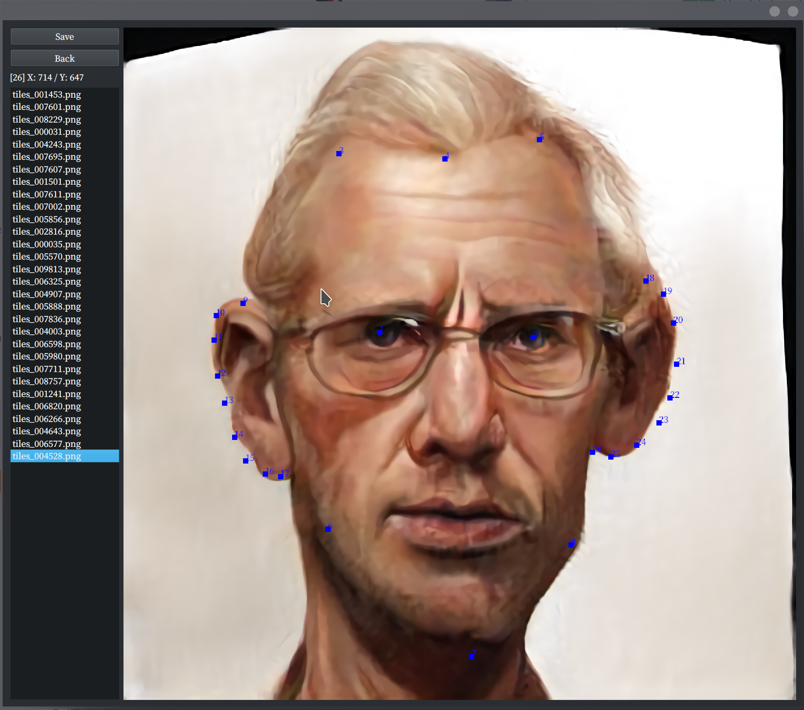

# 2D image landmark annotation GUI

## Features

- Jump around files easily (Landmarks are saved and loaded automatically when switching image)
- If initial annotation does not work, come back and modify landmark positions easily.

## Requirement

- Numpy
- PyQt6

## Usage

```bash
python main.py <input_image_dir> <output_landmark_txt_dir>
```

### GUI

1. Double-click an image file name in the list. Image shows up.
1. Left click on the image to add a landmark. Click "Back" to remove latest point.
1. Drag with right button to move around points.
1. Click "Save" or double-click other image files to save the landmarks.


